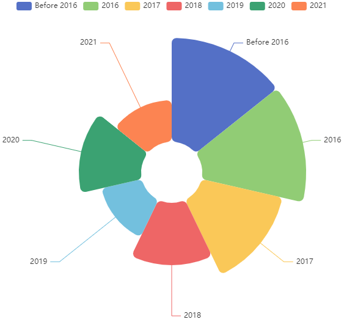

### The G4  Zoo

------

G-quadruplex, one of the non-canonical nucleic acid secondary structures, is associated with many biological functions, such as the regulation of replication and transcription et al. 

G-quadruplexes follow specific patterns, which were called G4 motifs. However, due to the structural diversity, there exist many non-standard G4s. And powerful or robust methods are needed to predict or detect the potential G-quadruplexes in any sequences.

Here, we collect the commonly used G4 detection or prediction tools, which are published in convinced journals and are easy to use. We will keep updating the list of G4 detection tools.

Inspired by [The GAN (Generative Adversarial Network) Zoo](https://github.com/hindupuravinash/the-gan-zoo), we designate it as The G4 Zoo. We hope that more and more researchers can join the development of G4-associated tools, and we hope that this list can help you with your research.

------

------

- DeepG4 - Web version not available, [Local version(R)](https://github.com/morphos30/DeepG4), [Paper](https://journals.plos.org/ploscompbiol/article?id=10.1371/journal.pcbi.1009308)

- G4detector - Web version not available, [Local verison(Python)](https://github.com/OrensteinLab/G4detector), [Paper](https://ieeexplore.ieee.org/abstract/document/9408415)

- PENGUINN - [Web version](https://ml-bioinfo-ceitec.github.io/penguinn/), [Local version(Python)](https://github.com/ML-Bioinfo-CEITEC/penguinn), [Paper](https://www.frontiersin.org/articles/10.3389/fgene.2020.568546/full)

- QPARSE - [Web version](http://www.medcomp.medicina.unipd.it/qparse/tool), [Local version(Python)](https://github.com/B3rse/qparse), [Paper](https://academic.oup.com/bioinformatics/article/36/2/393/5536767)

- pqsfinder - [Web version](https://pqsfinder.fi.muni.cz/), [Local version(R, bioconductor package)](https://bioconductor.org/packages/release/bioc/html/pqsfinder.html), [Paper](https://academic.oup.com/bioinformatics/article/33/21/3373/3923794)

- G4-iM Grinder - Web version not available, [Local version(R)](https://github.com/EfresBR/G4iMGrinder), [Paper](https://academic.oup.com/nargab/article/2/1/lqz005/5576141)

- G4 hunter - [Web version](https://bioinformatics.ibp.cz/#/), [Local version(Python)](https://github.com/AnimaTardeb/G4Hunter), [Paper](https://academic.oup.com/nar/article/44/4/1746/1854457)

- G4Catchall - [Web version](http://homes.ieu.edu.tr/odoluca/G4Catchall/), [Local version(Python)](https://github.com/odoluca/G4Catchall), [Paper](https://www.sciencedirect.com/science/article/abs/pii/S0022519318305976)

- G4RNA screener - [Web version](https://www.sciencedirect.com/science/article/abs/pii/S0300908418301597), [Local version(Python)](http://gitlabscottgroup.med.usherbrooke.ca/J-Michel/g4rna_screener), [Paper](https://academic.oup.com/bioinformatics/article/33/22/3532/4061281)

- G4PromFinder - Web version not available, [Local version(Python)](https://github.com/MarcoDiSalvo90/G4PromFinder), [Paper](https://bmcbioinformatics.biomedcentral.com/articles/10.1186/s12859-018-2049-x)

- Quadron - Web version not available, [Local version(R)](https://github.com/aleksahak/Quadron), [Paper](

- ImGQfinder - [Web version](http://imgqfinder.niifhm.ru/), [Local version(Python)](https://github.com/PollyTikhonova/ImGQfinder), [Paper](https://www.sciencedirect.com/science/article/pii/S0300908416303182)

- allquads - Web version not available, [Local verison(Perl)](https://journals.plos.org/plosone/article/file?type=supplementary&id=info:doi/10.1371/journal.pone.0146174.s001), [Paper](

- g4predict - Web version not available, [Local version(Python)](https://github.com/mparker2/g4predict), Paper not available

- RNAfold(-g, part of the ViennaRNA folding suite) - Web version not available, [Local version(C,C++,Perl)](https://www.tbi.univie.ac.at/RNA/), [Paper](https://almob.biomedcentral.com/articles/10.1186/1748-7188-6-26)

- G4-PREDICTOR V.2 - [Web verison](http://bsbe.iiti.ac.in/bsbe/ipdb/update/tool.html), Local version not available, [Paper](https://www.nature.com/articles/srep38144)

- TetraplexFinder - [Web version](http://quadbase.igib.res.in/TetraPlexFinder), Local version not available, [Paper](https://academic.oup.com/nar/article/44/W1/W277/2499382)

- nBMST - [Web version](https://nonb-abcc.ncifcrf.gov/apps/nBMST/default/), [Local version(C)](https://github.com/abcsFrederick/non-B_gfa), [Paper](https://currentprotocols.onlinelibrary.wiley.com/doi/10.1002/0471142905.hg1807s73)

- QGRS Mapper - [Web version](https://bioinformatics.ramapo.edu/QGRS/analyze.php), [Local version(C++)](https://github.com/freezer333/qgrs-cpp), [Paper](https://academic.oup.com/nar/article/34/suppl_2/W676/2505656)

- G4P Calculator - Web version not available, [Local version(C#)](https://depts.washington.edu/maizels9/G4calc.php), [Paper](https://academic.oup.com/nar/article-lookup/doi/10.1093/nar/gkl529)

- Quadfinder - [Web version](http://miracle.igib.res.in/quadfinder/), Local version not available, [Paper](https://academic.oup.com/nar/article/34/suppl_2/W683/2505703)

- Quadparser - Not available, [Paper](https://academic.oup.com/nar/article/33/9/2908/2401500)

  ------

  

### Contact

If you have any questions, feel free to contact me. (I may miss some software, as these are manually organized)

rongxinzhang@seu.edu.cn

Last update, August 31, 2021

